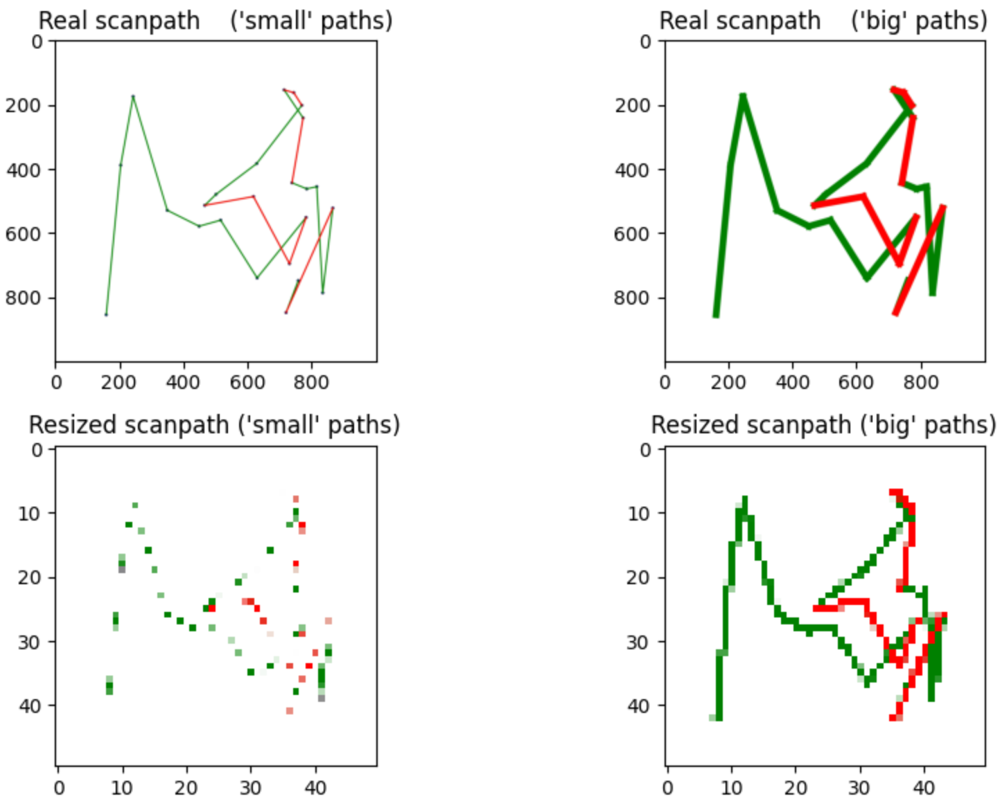
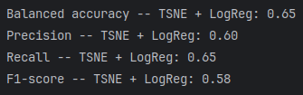
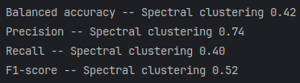
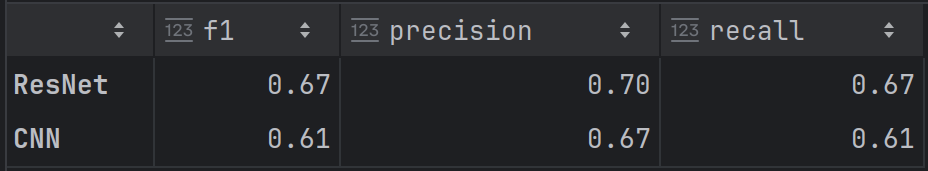

## Final Paper

Using graph representations of eye tracking data for building machine learning models

### Команда

Даудов Вагиз, Кондауров Захар

### Литература:
* [Children ASD Evaluation Through Joint Analysis of EEG and Eye-Tracking Recordings With Graph Convolution Network](https://www.frontiersin.org/journals/human-neuroscience/articles/10.3389/fnhum.2021.651349/full). 
Предсказывают наличие расстройства аутистического спектра. Обучают GCN.
Также используются вторая модальность —
EEG данные. Вершинами графа были признаки, а ребра между ними определялись матрице корреляции. 
Для eye-tracking данных получилась f1 мера равная 0.8571
* [GazeGNN: A Gaze-Guided Graph Neural Network for Chest X-ray Classification](https://openaccess.thecvf.com/content/WACV2024/papers/Wang_GazeGNN_A_Gaze-Guided_Graph_Neural_Network_for_Chest_X-Ray_Classification_WACV_2024_paper.pdf)
На основе eye-tracking данных предсказывается есть ли пневмония у пациента или нет.
* [Gaze Gesture Recognition by Graph Convolutional Networks](https://www.frontiersin.org/journals/robotics-and-ai/articles/10.3389/frobt.2021.709952/full)
Определения жестов-взглядов. Граф строился, основываясь на гейзах. Каждая точка является вершиной графа, которая соединяется с ближайшими k вершинами. Использовалась GCN модель. Accuracy = 97.62%

### План

1. Обзор литературы по применению графов в исследованиях с использованием данных движений глаз.
2. Подбор датасетов для экспериментов.
3. Использование метрик схожести траекторий движений для построения глобальных графов (1 нода = 1 траектория).
4. Построение локальных графов (1 граф = 1 траектория) на основе фиксаций/зон интереса.
5. Изучение свойств полученных графов для разных датасетов (графовые характеристики, community detection (если это будет возможно проинтерпретировать), и др.).
6. Решение unsupervised задач (кластеризации) на созданных графах.
7. Извлечение фичей из графов классическими методами (спектральное разложение и др.) и использование фичей для Supervised задач.
8. Применение методов глубокого обучения для того же самого.

### Датасеты

* https://zenodo.org/records/2647418: 300 images (14 asd, 14 non asd)
* https://zenodo.org/records/3668740: скачать и посмотреть
* https://figshare.com/articles/dataset/Eye-Tracking_Dataset_to_Support_the_Research_on_Autism_Spectrum_Disorder/20113592?file=35980367 — 25 экспериментов с несколькими участниками: надо уточнить сколько в каждом, пересекаются ли они, т.д.
* https://nih.figshare.com/articles/dataset/Eye_tracking_data_for_participants_with_Autism_Spectrum_Disorders_for_Distinct_neural_mechanisms_of_social_orienting_and_mentalizing_revealed_by_independent_measures_of_neural_and_eye_movement_typicality_/10324877?file=18788432 – ещё один датасет про ASD (62 TD, 36 ASD)
* https://figshare.com/articles/dataset/ADHD_Pupil_Size_Dataset/7218725?file=14298953 – люди с ADHD выполняют различные задания на проверку когнитивных способностей
* https://zenodo.org/records/13332134 – датасет про дислексию
* https://zenodo.org/records/5775674 — датасет с эмоциональным состоянием участинков

### Эксперименты

1. Similarity Matrix.
   1. Анализ различных дистанций.
      1. Отбираем 20 разношерстных картинок, получаем матрицу инцидентности 560 на 560.
      2. Отбираем несколько дистанций, смотрим на зависимость доли оставшихся ребер от величины порога. Фиксируем долю ребер, которую хотим оставить. Далее работаем с графами одного размера (для каждой).
      3. Проанализируем то, насколько похожи некоторые дистанции. С similarity matrix и конкретным порогом, они выдают граф на одинаковом множестве вершин, а тогда у нас определены разность/пересечение графов. Можем сказать, что похожесть метрик прямо пропорциональна размеру пересечения графов (возьмем graph edit distance). Этот результат сравнить с полученной модулярностью в 3.1.4.
      4. Community detection на датасете с картинками. Экспериментируя с числом ребер (то есть по порогу), смотрим на модулярность (leiden-а используем) и однородность полученных community. Вне зависимости от результата, конспектируем увиденное. Цель: найти метрику, которая выдает максимальную модулярность и однородность. Если все плохо, то так и оставляем.

   2. Анализ результата community detection с наилучшей модулярностью.
      1. SimRank вершин в глобальном графе. Гипотеза: вершины людей с аутизмом похожи в первую очередь на вершины других людей с аутизмом.
      2. Посмотреть на однородность по наличию/отсутствию аутизма в полученных community.
      3. Посмотреть на betweenness, есть ли какие-то хабы, и если да, то что это за объекты.

   3. Классический ML, сравнить с community detection (там совсем плохой классификатор).
      1. Прикручиваем библиотеку `eyefeatures`.
      2. Isomap.
      3. Spectral clustering (посмотреть как структура кластеров соотносится с классами).
      4. Graph Kernels (Weisfeiler-Lehman Kernel, Shortest Path Kernel, Graphlet Kernel) for SVM, lin reg, logreg etc.
      5. MDS methods (MDS, TSNE).

2. DL, выбрать архитектуру и задачу.
   1. Scanpath визуализация (participant, text) -> CNN -> классификация дислексия/не дислексия.
   2. Node2vec + KNN, классификация вершин по эмбеддингам.

### Результаты

Визуализация scanpaths.

Метрики по классическому ML (самое релевантное).

Метрики по DL (ResNet18, custom CNN).

### Вывод

Получили рост качества по мере улучшения сложности классификатора (в порядке повышения F1):

* Community detection (leiden).
* ML kernel methods (statistical features from `eyefeatures` in nodes, graph classification, graph -- participant).
* ML catboost (embeddings from MDS).
* ML logreg (embeddings from MDS).
* DL CNN.
* DL ResNet.
